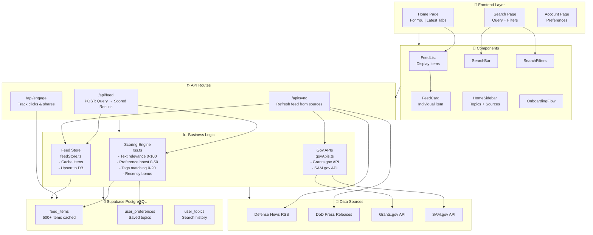

# Defense & Gov Signal Feed

Full‑stack Next.js app that turns defense tech news and US government funding data into a Twitter‑style feed, curated around user interests and search queries.

## Architecture Overview



## Project Structure

```
src/
├── app/                           # Next.js App Router
│   ├── page.tsx                   # Home page (For You + Latest tabs)
│   ├── search/
│   │   └── page.tsx               # Search page with filters
│   ├── account/
│   │   └── page.tsx               # User preferences/settings
│   ├── layout.tsx                 # Root layout
│   └── api/
│       ├── feed/
│       │   └── route.ts           # Main feed endpoint (scoring + mixing)
│       ├── sync/
│       │   └── route.ts           # Background sync from all sources
│       ├── engage/
│       │   └── route.ts           # Track user clicks & shares
│       └── trending/              # (deprecated)
│
├── components/                    # React components
│   ├── FeedList.tsx               # List container with inline prompts
│   ├── FeedCard.tsx               # Individual feed item display
│   ├── SearchBar.tsx              # Search input
│   ├── SearchFilters.tsx          # Filter controls (time, source, sort)
│   ├── HomeSidebar.tsx            # Topics + sources sidebar
│   ├── LayoutShell.tsx            # Main layout wrapper
│   ├── OnboardingFlow.tsx         # First-time user flow
│   ├── BottomNav.tsx              # Mobile navigation
│   ├── AuthPreferencesPanel.tsx   # Account preferences UI
│   ├── Providers.tsx              # Context providers
│   ├── Toast.tsx                  # Toast notifications
│   └── InlineFeedPrompt.tsx       # Feedback prompts in feed
│
├── lib/                           # Utilities & business logic
│   ├── rss.ts                     # Core scoring algorithm (~250 lines)
│   ├── feedStore.ts               # DB caching + sync coordination
│   ├── govApis.ts                 # Grants.gov & SAM.gov integration
│   ├── supabaseClient.ts          # Supabase client setup
│   ├── engagement.ts              # Analytics tracking
│   └── bookmarks.ts               # Bookmark utilities (deprecated)
│
└── types/
    └── feed.ts                    # TypeScript interfaces
```

## How It Works

### Data Flow

1. **Background Sync** (`/api/sync`)
   - Fetches from 4 sources: 2 RSS feeds, Grants.gov API, SAM.gov API
   - Normalizes all items to `FeedItem` type
   - Upserts into `feed_items` table (keeping 500 most recent)
   - Runs on-demand or via Vercel Crons every 15-30 minutes

2. **Feed Request** (`/api/feed` - POST)
   - Receives user query + optional userId
   - Loads saved preferences if authenticated
   - Scores all stored items using `scoreFeedItemsFromQuery()`
   - Returns two result sets:
     - **"For You"**: Top 50 scored items ranked by relevance
     - **"Latest"**: All items sorted by date with sources randomly mixed

3. **Scoring Algorithm** (`src/lib/rss.ts`)
   - **Text Relevance** (0-100 points): Matches query words against title/summary/tags
   - **Preference Boost** (0-50 points): Extra weight for user's saved topics
   - **Tags Matching** (0-20 points): Exact tag matches
   - **Recency Bonus** (0-20 points): Very recent items get a boost
   - Total score range: 0-190 points

4. **Frontend Rendering**
   - **Home Page**: Shows "For You" vs "Latest" tabs
     - Loads feed from user's saved preferences automatically
     - No search bar - focuses on personalized content
     - "For You" tab: Preference-ranked results
     - "Latest" tab: Chronological with mixed sources to avoid clustering
   - **Search Page**: Allows custom queries
     - Searches across all 500 cached items
     - Filters by source, time range, sort order
     - Shows relevance ranking or date ordering
   - **Account Page**: Set/manage preference topics

### Key Components

| Component | Purpose |
|-----------|---------|
| `FeedList` | Main feed container, renders items with inline prompts |
| `FeedCard` | Individual item card with title, badge, tags, action buttons |
| `SearchBar` | Query input (search page only) |
| `SearchFilters` | Time range, source, and sort controls |
| `HomeSidebar` | Shows saved topics and available data sources |
| `OnboardingFlow` | First-time user topic selection dialog |
| `LayoutShell` | Page layout wrapper with nav and sidebar |
| `BottomNav` | Mobile navigation tabs |

### Key Libraries

| Library | Purpose |
|---------|---------|
| `rss-parser` | Parse RSS feeds |
| `date-fns` | Date formatting |
| `zod` | Request validation |
| `@supabase/supabase-js` | Database client |
| `Tailwind CSS` | Styling |

## Stack

- **Frontend**: Next.js 16+ (App Router, TypeScript), Tailwind CSS
- **Backend**: Next.js Route Handlers
- **Database**: Supabase PostgreSQL
- **Data Sources**:
  - Defense News & DoD Press Releases (RSS)
  - Grants.gov (public API)
  - SAM.gov (API - requires key)

## Environment Setup

```bash
# Clone and install
git clone <repo>
cd pryzm-project
npm install

# Create .env.local
cp .env.example .env.local
```

Fill in `.env.local`:
```
NEXT_PUBLIC_SUPABASE_URL=https://your-project.supabase.co
NEXT_PUBLIC_SUPABASE_ANON_KEY=your-anon-key
SAM_GOV_API_KEY=your-sam-key (optional)
```

**Getting SAM.gov API Key (Optional):**
1. Visit [SAM.gov](https://sam.gov)
2. Create an account
3. Navigate to **Account Details**
4. Generate an API key
5. Add to `.env.local`

Without the SAM.gov key, the system still works but skips contract syncing.

## Running Locally

```bash
npm run dev
# or
yarn dev
```

Open [http://localhost:3000](http://localhost:3000)

## Deploying to Vercel

1. Push to GitHub
2. Create Vercel project from repo
3. Add env vars in **Project Settings → Environment Variables**
4. *(Optional)* Set up Vercel Cron:
   - Add `CRON_SECRET` env var
   - Configure cron job to hit: `GET /api/sync?token=CRON_SECRET`
   - Schedule: Limited to 1 time a day with Vercel free trial.

Deploy – Vercel auto-detects Next.js.

## Learn More

- [Next.js Docs](https://nextjs.org/docs)
- [Supabase Docs](https://supabase.com/docs)
- [Tailwind CSS](https://tailwindcss.com)
